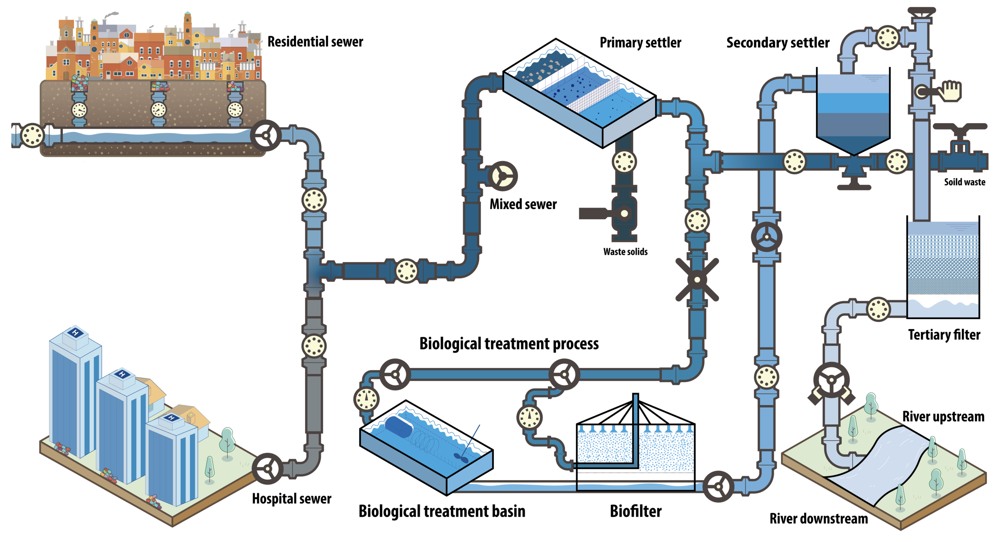

# Shift in Associations of Defense with MGEs from Sewer to Biofilter

## About this project

- This is a project finding defense systems.

## Build with

For raw sequencing data, use python and shell. For statistic analysis and ploting, use R.

## Project Background

## Data Collection

|   |   |   |
| --- | --- | --- |
|   |   |   |
|   |   |   |

## Scripts Explain

00X: Common tools for dealing with the data.

10X: Sequence Pre-processing, Classification.

20X: Annotation.

30X: Original Output to table.

40X: Get Full Table.

50X: Statistic Computing and Ploting.

60X:

## Contributing

Haotian Zheng wrote the manuscript and excute the data classification, annotation, statistic, and ploting. Professor Søren and Associate Professor Rafa worte the grant, Wanli excute the

## Contact

Haotian Zheng - haotian.zheng@bio.ku.dk

## Acknowledgments

Thanks for Professor Søren.
